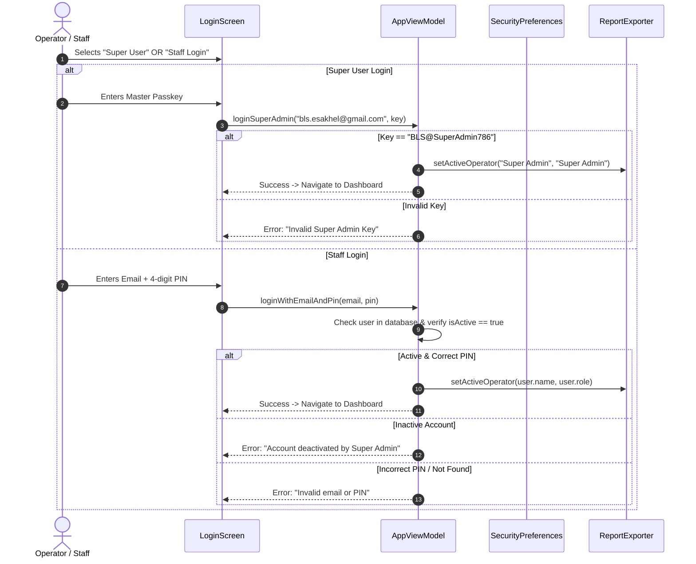
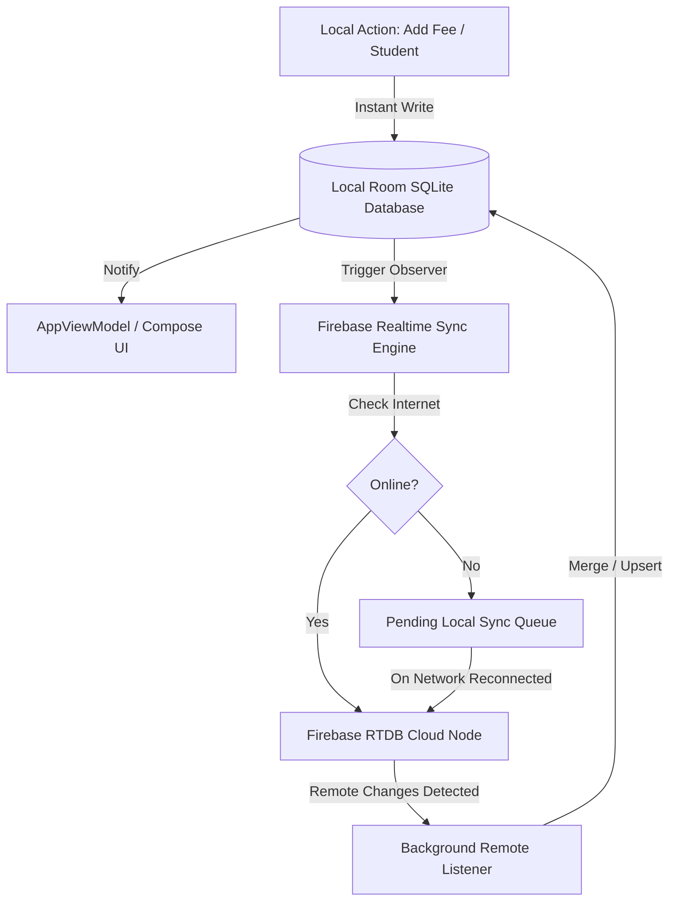

# BLS Cash Record & School Management System — Complete Workflow & Architecture Guide

> **Current Version:** `v1.0.7` (versionCode: `8`)  
> **Target Platform:** Android (Native Kotlin with Jetpack Compose)  
> **Database:** Local-First Room Database + Firebase Realtime Database (Two-way Live Sync)  
> **Official Super Admin Identity:** `bls.esakhel@gmail.com`  
> **Institution:** Blended Learning School (BLS), Isa Khel  

---

## 📑 Table of Contents
1. [System Overview & Architecture Philosophy](#1-system-overview--architecture-philosophy)
2. [User Roles & Security Access Matrix](#2-user-roles--security-access-matrix)
3. [Authentication & Session Flow](#3-authentication--session-flow)
4. [User Management Workflow (Super Admin Portal)](#4-user-management-workflow-super-admin-portal)
5. [Students Lifecycle & Academic Operations](#5-students-lifecycle--academic-operations)
   - 5.1 Student Admission & Fee Structuring
   - 5.2 Student Profile, Promotion & Exit Settlement (SLC)
   - 5.3 Family / Sibling Fee Grouping
6. [Financial Ledger, Cashbox & Banking Engine](#6-financial-ledger-cashbox--banking-engine)
   - 6.1 Income & Fee Collection
   - 6.2 Expenditure Management & Salary Disbursement
   - 6.3 Contra Transfers (Cash vs. Bank Settlement)
7. [Daily Closing, Audit & Financial Reports](#7-daily-closing-audit--financial-reports)
   - 7.1 Day-End Cashier Closing Process
   - 7.2 Reports & Audit PDF Registers
8. [Printing, PDF Export & "Received By" Signature System](#8-printing-pdf-export--received-by-signature-system)
9. [Two-Way Real-time Cloud Sync & Offline-First Engine](#9-two-way-real-time-cloud-sync--offline-first-engine)
10. [In-App Automatic Update & Release Mechanism](#10-in-app-automatic-update--release-mechanism)
11. [Data Model & Database Schema Reference](#11-data-model--database-schema-reference)

---

## 1. System Overview & Architecture Philosophy

BLS Cash Record is an enterprise-grade school accounting and student management system built with an **Offline-First (Local-First)** architecture:
- **Instant Speed:** Every transaction, admission, or fee receipt is immediately written to the local SQLite/Room database in zero milliseconds.
- **Resilience:** The application continues full functionality with or without internet connectivity.
- **Conflict-Free Real-time Cloud Sync:** Backed by Firebase Realtime Database, synchronizing transactions, student records, closings, user logs, and audit trails seamlessly across multiple authorized devices.
- **Complete Paper Audit Trail:** Every transaction voucher, student fee slip, 3-copy challan, and ledger sheet includes automated cashier signatures, timestamps, and barcodes.

```
┌──────────────────────────────────────────────────────────┐
│                   Jetpack Compose UI                     │
│  (LoginScreen, BLSApp, StudentsTab, LedgerTab, Reports) │
└────────────────────────────┬─────────────────────────────┘
                             │ StateFlow / Events
┌────────────────────────────▼─────────────────────────────┐
│                       AppViewModel                       │
│    (Business Logic, Auth, Calculations, Validations)     │
└──────────────┬────────────────────────────┬──────────────┘
               │                            │
┌──────────────▼─────────────┐ ┌────────────▼──────────────┐
│       AppRepository        │ │      ReportExporter       │
│  (Database Ops & Queries)  │ │ (Canvas Vector PDF Engine)│
└──────────────┬─────────────┘ └───────────────────────────┘
               │
   ┌───────────┴───────────┐
   │                       │
┌──▼──────────────┐  ┌─────▼──────────────────────────────┐
│  Room Database  │  │  Firebase Realtime Database Sync   │
│  (Offline-First)│  │ (Background Two-Way Auto Sync)     │
└─────────────────┘  └────────────────────────────────────┘
```

---

## 2. User Roles & Security Access Matrix

| Role | Target User | Login Method | Permissions |
| :--- | :--- | :--- | :--- |
| **Super Admin** | `bls.esakhel@gmail.com` | Master Security Key (`BLS@SuperAdmin786`) / Biometrics | **Full Root Control:** Create & delete accounts, toggle active/inactive staff, change staff PINs, reset database, configure cloud sync keys, execute day-end closings, audit logs. |
| **Admin** | School Principal / Head Admin | Registered Email + 4-digit PIN | **Full Management:** Admit students, edit particulars, collect fees, disburse salaries, enter school expenses, view all reports, generate student clearance. |
| **Accountant** | Counter Cashier / Accounts Clerk | Registered Email + 4-digit PIN | **Operational Counter:** Fee collection, issuing 3-part challans, daily expenses, search students, print counter receipts. Restricted from system configuration. |
| **None** | Logged out state | Restricted | Cannot view any screen except the Authentication Portal. |

---

## 3. Authentication & Session Flow

The authentication system operates with strict identity isolation:



### Key Security Safeguards:
1. **No Legacy Bypass:** PIN `8888` is strictly blocked from logging into the Super User portal. Only `BLS@SuperAdmin786` is accepted.
2. **Auto Whitespace Sanitization:** All email and passkey inputs undergo `.trim()` and `.lowercase()` processing to prevent accidental keyboard trailing spaces.
3. **Live Error Banners:** Both Super Admin and Staff login views render inline warning alerts with detailed error descriptions.
4. **Biometric Support:** Fingerprint or Face ID login automatically authenticates the last configured user on registered hardware.

---

## 4. User Management Workflow (Super Admin Portal)

Only accessible when logged in as `bls.esakhel@gmail.com`:

1. **Adding New Staff:**
   - Super Admin clicks **User Menu (Top-Right) ➔ Staff User Management**.
   - Fills out: **Full Name**, **Email Address**, **Role** (Admin / Accountant), and sets an initial **4-Digit PIN**.
   - Upon clicking **"Create & Activate User"**, the user record is stored locally and synchronized to Firebase Cloud.
2. **Instant Invitation & Credential Sharing:**
   - A direct sharing dialog triggers with pre-composed instructions:
     > *"Hello [Staff Name], your BLS Cash Record account has been created.  
     > Email: [staff@bls.school]  
     > 4-Digit PIN: [XXXX]  
     > Role: [Accountant]  
     > Please install the app and login using your email & PIN."*
   - Can be dispatched directly via WhatsApp or Email.
3. **Account Deactivation / Kill Switch:**
   - Super Admin can switch a user's status between **Active** and **Inactive** with one tap.
   - If deactivated, that staff member is instantly prevented from logging in on any device.
4. **PIN Resetting:**
   - Super Admin can change any forgotten PIN for staff without deleting transaction history.

---

## 5. Students Lifecycle & Academic Operations

### 5.1 Student Admission & Fee Structuring
- **Path:** `Students Tab ➔ + Admit Student` (or Floating Speed-Dial).
- **Mandatory Particulars:**
  - Full Student Name, Father's Name, Contact Number, CNIC/B-Form.
  - Class Level (`PG` to `Class 8`), Admission Date, Date of Birth, Gender.
  - Registration / Roll Number (Auto-assigned or manually specified).
- **Fee Configuration:**
  - One-Time Admission Fee (PKR).
  - Monthly Tuition Base Fee (PKR).
  - Annual Promotional / Session Charges (PKR).
  - Scholarship / Concession Category:
    - *None (0%)*, *Sibling (20% or 40%)*, *Orphan (50%)*, *Teacher's Child (50%)*, *Poor / Merit Free (100%)*, *Special Concession (10%)*.
- **Instant Admission Receipt:**
  - Generates official 3-copy admission challan and admission certificate with school seal upon enrollment.

### 5.2 Student Profile, Promotion & Exit Settlement (SLC)
- **Real-Time Balance Ledger:** Each student card displays total paid amount, unpaid fee arrears, and payment timeline.
- **Fee Concession Adjustment:** Staff can update concession status on the fly.
- **Academic Promotion:** Batch promotion engine promotes classes at end of session (e.g., Class 4 to Class 5).
- **Exit Settlement & School Leaving Certificate (SLC):**
  - Path: `Student Detail ➔ Exit Settlement / SLC`.
  - Calculates all pending dues up to the leaving month.
  - Generates a **3-Part Clearance Challan**.
  - Once dues are settled, exports an official **School Leaving Certificate (SLC) PDF** with clearance checkmarks (Library, IT Lab, Dues, Sports).

### 5.3 Family / Sibling Fee Grouping
- Multiple children sharing the same father name or family phone number can be grouped together.
- Allows paying fees for 2 to 5 siblings simultaneously with a single combined receipt (**Family Fee Slip PDF**), saving time and paper.

---

## 6. Financial Ledger, Cashbox & Banking Engine

Every rupee entering or leaving the school passes through the immutable double-entry ledger.

### 6.1 Income & Fee Collection
1. **Regular Fee Receiving:**
   - Select student ➔ Click **Collect Fee**.
   - System auto-fills the discounted monthly fee and shows outstanding arrears.
   - Choose payment mode: **Cash** (enters Cash Box) or **Bank** (enters School Bank Account).
   - Generates instant **Fee Slip** or **Thermal 58mm Slip** with cashier name.
2. **Bulk Class Challan Printing:**
   - Select whole class (e.g., "Class 6") ➔ **Generate Monthly Challans**.
   - Prepares printable A4 sheets containing 3 copies per student (Bank Copy, School Copy, Student Copy) with auto-calculated arrears and late fees.

### 6.2 Expenditure Management & Salary Disbursement
- **Expense Categories:**
  - Staff / Teacher Salaries, Building Rent, Utility Bills (Electricity, Water), Entertainment / Refreshment, Stationery & Exam Papers, Repair & Maintenance, Internet.
- **Salary Disbursement Portal:**
  - Records teacher/staff payslips with month, designation, and payment mode.
  - Generates **Staff Salary Payslip Voucher PDF** and **Monthly Payroll Register**.
- **General Expense Voucher:**
  - Auto-converts numbers to English words (e.g., `Rs. 45,000` ➔ *"Forty Five Thousand Rupees Only"*).
  - Generates **Official Expense Payment Voucher PDF**.

### 6.3 Contra Transfers (Cash vs. Bank Settlement)
Transfers between internal cash and bank accounts are automatically detected via `DomainConstants.isContraTransfer()`:
- `Cash Deposit into Bank`: Deducts from Cash Box, increments Bank Account.
- `Cash Withdrawal from Bank`: Deducts from Bank, increments Cash Box.
- *Contra transfers do not distort operational school profit/loss.*

---

## 7. Daily Closing, Audit & Financial Reports

### 7.1 Day-End Cashier Closing Process
At the end of every business day, the cashier locks the till:
1. Operator navigates to **Reports Tab ➔ Perform Daily Closing**.
2. System computes:
   - Starting Opening Cash Balance.
   - Total Day Inflows (Fees, Other Income).
   - Total Day Outflows (Expenses, Salaries).
   - Expected Closing Cash Box Balance.
3. Operator physically counts cash and enters actual cash drawer count.
4. Any surplus or deficit is explicitly logged and saved to the audit ledger.
5. Emits a **Daily Closing History Record** and syncs to cloud storage.

### 7.2 Reports & Audit PDF Registers
The system produces vector-rendered PDF documents:
- **General Transactions Ledger (Multi-Page Paginated):** Comprehensive date-range cashflow summary.
- **Class-Wise Recovery & Overdue Audit:** Target vs. collected vs. defaulters summary table.
- **Defaulters Master List:** Phone numbers and outstanding balances for follow-up.
- **Expense Breakdown Pie Analysis:** Category-wise percentage distribution.
- **Daily Closing History Audit Register:** Complete log of cash drawers over time.

---

## 8. Printing, PDF Export & "Received By" Signature System

All documents rendered by `ReportExporter.kt` incorporate institutional signature fields dynamically based on the logged-in session operator:

### Signature Format Rules
- **If Staff Member "Fatima" (Role: Admin) is logged in:**
  ```
  ___________________________          ___________________________
     Depositor Signature                  Received: Fatima (Admin)
                                          Date: 08-Oct-2026 06:30 AM
  ```
- **If Staff Member "Ali" (Role: Accountant) is logged in:**
  ```
  ___________________________          ___________________________
     Depositor Signature                  Received: Ali (Accountant)
  ```
- **If Logged in as Super Admin:**
  ```
  ___________________________          ___________________________
     Depositor Signature                  Received: Super Admin
  ```

### Documents Supported by the Signature Engine:
1. **3-Part Fee Challan (A4 Landscape):** Bank, School, and Student copies.
2. **Admission Package Challan:** 3-copy initial package voucher.
3. **Official Admission Form:** With *"Admitted / Received By: [Name]"* seal.
4. **Dual-Copy Fee Slip (A4 Portrait):** School & Student copies with cut-line.
5. **Thermal 58mm POS Counter Slip:** Compact receipt with *"Received By: [Name]"*.
6. **Family / Multi-Sibling Fee Slip:** Combined sibling receipt.
7. **Expense Payment Voucher:** *"Prepared: [Name]"* in audit block.
8. **Staff Salary Slip:** *"Disbursed: [Name]"* in account officer block.
9. **Monthly Payroll Register Sheet:** Landscape disbursement sheet.
10. **Class-Wise Fee Recovery Audit:** Audit footer tracking.
11. **Daily Closing History PDF:** Operator timestamped metadata.
12. **All General Ledgers:** *"Issued By: [Name]"* banner.

---

## 9. Two-Way Real-time Cloud Sync & Offline-First Engine

Managed through `FirebaseRealtimeSyncManager.kt` and `AppRepository.kt`:



### Sync Capabilities:
- **Zero Data Loss:** Transactions recorded during power or internet outages are safely cached locally and dispatched automatically upon reconnection.
- **Configurable Cloud URL:** Super Admin can adjust the Firebase Database URL and Auth Secret from inside the **Cloud Sync Settings** modal.
- **Manual Force Sync:** One-tap button to perform an immediate cloud reconciliation check.

---

## 10. In-App Automatic Update & Release Mechanism

Managed through `GitHubUpdateManager.kt` and `AppUpdateDialog.kt`:
1. **Automatic GitHub Polling:** Upon dashboard launch, the app polls the GitHub releases endpoint (`devsamikhan/theBLS`).
2. **Version Code Comparison:** If remote `versionCode > local versionCode`, an update banner alerts the staff.
3. **Direct In-App Downloader:** Downloads the latest `.apk` file directly to the device with a real-time progress bar.
4. **One-Tap Package Installer:** Directly triggers Android's Package Installer Intent with `FileProvider` permissions for seamless updates.

---

## 11. Data Model & Database Schema Reference

### 11.1 Student Entity (`students`)
```kotlin
@Entity(tableName = "students")
data class Student(
    @PrimaryKey(autoGenerate = true) val id: Int = 0,
    val regNo: String,               // Unique Registration / Roll #
    val studentName: String,         // Student Full Name
    val fatherName: String,          // Father / Guardian Name
    val contactNumber: String,       // Phone number for SMS / WhatsApp
    val cnicOrBForm: String,         // National ID / B-Form
    val className: String,           // Class Level (PG - Class 8)
    val admissionDate: Long,         // Timestamp of admission
    val dob: Long,                   // Date of birth
    val gender: String,              // Male / Female
    val address: String,             // Residential address
    val admissionFee: Double,        // Initial one-time fee
    val monthlyFee: Double,          // Base tuition fee rate
    val annualCharges: Double,       // Session annual charges
    val otherCharges: Double,        // Prospectus / exam charges
    val discountType: String,        // Sibling 20%, Orphan 50%, None, etc.
    val status: String,              // Active, Left, Alumni, Struck Off
    val lastPromotedDate: Long,      // Promotion record
    val notes: String                // Medical / Academic notes
)
```

### 11.2 Transaction Entity (`transactions`)
```kotlin
@Entity(tableName = "transactions")
data class Transaction(
    @PrimaryKey(autoGenerate = true) val id: Int = 0,
    val studentId: Int?,             // Optional link to student
    val date: Long,                  // Epoch timestamp of transaction
    val amount: Double,              // Transaction value in PKR
    val isIncome: Boolean,           // true = Inflow, false = Outflow
    val category: String,            // Fee Received, Staff Salary, Rent, etc.
    val description: String,         // Purpose / Narration / Remarks
    val paymentMode: String,         // Cash or Bank
    val voucherNo: String,           // Official voucher number
    val monthOfFee: String?,         // e.g. "October 2026"
    val recordedBy: String           // Username of operator who created record
)
```

### 11.3 Daily Closing Entity (`daily_closings`)
```kotlin
@Entity(tableName = "daily_closings")
data class DailyClosing(
    @PrimaryKey(autoGenerate = true) val id: Int = 0,
    val date: Long,                  // Closing date timestamp
    val openingCash: Double,         // Opening cash in till
    val closingCash: Double,         // Physical cash drawer total
    val openingBank: Double,         // Opening bank balance
    val closingBank: Double,         // Closing bank balance
    val totalIncomeCash: Double,     // Day's cash receipts
    val totalExpenseCash: Double,    // Day's cash expenditures
    val totalIncomeBank: Double,     // Day's bank deposits
    val totalExpenseBank: Double,    // Day's bank withdrawals
    val difference: Double,          // Discrepancy (Surplus / Deficit)
    val closedBy: String,            // Name of operator performing closing
    val notes: String                // Remarks
)
```

### 11.4 App User Entity (`app_users`)
```kotlin
@Entity(tableName = "app_users")
data class AppUser(
    @PrimaryKey val email: String,   // Staff unique email
    val name: String,                // Full display name (e.g. Fatima, Ali)
    val pin: String,                 // 4-Digit authentication code
    val role: String,                // Admin or Accountant
    val isActive: Boolean,           // Access permission toggle
    val createdDate: Long,           // Account registration timestamp
    val lastLoginDate: Long          // Last activity timestamp
)
```

---
*Documented and verified against codebase version `v1.0.7` for Blended Learning School (BLS).*
